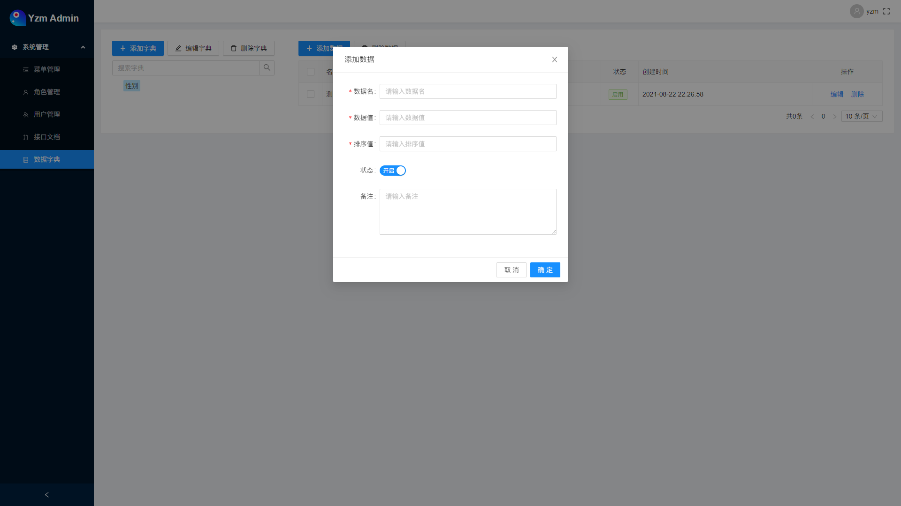

## Yzm Admin
> Coded in 2021.06；\
> 从0到1，独立完成；\
> 产品设计->UI设计->前端开发->后端开发。

### 一款基于React开发的清新脱俗后台管理框架
> 目前暂未完成，一些核心功能扔在开发中

#### 前言：
    总觉得市面上的后台管理框架，权限控制用起来不太灵活；

    通常都是配置权限按钮，这样就仅仅局限于按钮的权限控制了；
    我引入了一个权限项的概念，前端和后端可以进行封装，然后可以在项目中随处进行判断使用，而不仅仅局限于按钮；
    这样的权限控制，你想怎么写就怎么写，比如控制一个内容的显示，用户昵称是否隐私化展示等等，都可以实现；

    菜单结构的配置通常也是栏目-菜单-按钮这样的强顺序组合；
    而我的设想是：
    栏目下可以再套栏目
    栏目下可以套菜单
    栏目下可以套权限项，权限项就是当前栏目的局部权限
    菜单下可以套权限项，权限项就是当前菜单的局部权限
    顶层也可以配置权限项，这样就是全局权限

    可以看到权限项可以随处放，通过父级也实现了权限控制作用域的效果。

#### 技术栈关键词：
* react
* redux
* immutable
* react-router（配合接口实现权限控制）
* antd
* styled-components
* axios
* nodejs
* express
* mysql
* jwt
* apidoc

> 以下已勾选的则是已完成内容

### 菜单管理模块：
- [x] 树形节点管理
- [x] 节点类型：栏目、菜单、权限项
- [x] 节点启用禁用
- [x] 节点排序
- [x] 节点-栏目：名称、编码、图标、路径等
- [x] 节点-菜单：名称、编码、图标、路径、前端组件路径等
- [x] 节点-权限项：名称、编码、图标等

### 角色管理：
- [x] 角色名称
- [x] 角色编码
- [x] 角色级别
- [x] 是否默认角色
- [x] 角色备注
- [x] 角色菜单权限管理
- [x] 角色接口权限管理
- [x] 角色新增编辑删除

### 用户管理：
- [x] 用户头像
- [x] 用户昵称
- [x] 登录账号
- [x] 用户手机
- [x] 用户角色
- [x] 启用禁用
- [x] 用户新增编辑删除

### 接口文档：
- [x] 接口分组
- [x] 接口请求方式
- [x] 接口地址
- [x] 请求参数，是否必填，参数类型，参数描述，是否角色鉴权

### 数据字典：
- [x] 字典新增编辑删除
- [x] 字典数据名称
- [x] 字典数据值
- [x] 字典数据排序
- [x] 字典启用禁用
- [x] 字典数据备注

### 文件管理：
- [ ] 分组
- [ ] 上传
- [ ] 删除
- [ ] 预览
- [ ] 类型
- [ ] 大小
- [ ] 原文件名
- [ ] 存储文件名
- [ ] 重命名

### 系统配置：
- [ ] 文件对象存储配置
- [ ] 短信配置

### 图标管理：
- [x] antd icon
- [ ] 自定义iconfont图标
- [ ] 自定义图片图标

### 其他：
- [ ] 页面tab标签
- [ ] 菜单搜索
- [ ] 主题配置
- [ ] 验证码登录
- [ ] 社交账号绑定
- [ ] 社交账号登录
- [ ] 系统核心菜单只读
- [ ] 权限项作用域
- [ ] 权限项控制，前端后端均暂未封装

登录页

菜单管理

菜单管理-添加节点

菜单管理-节点父级选择

菜单管理-节点图标选择

菜单管理-菜单节点编辑

菜单管理-栏目节点编辑

菜单管理-权限项节点编辑

角色管理

角色管理-添加角色

角色管理-菜单权限

菜单管理-接口权限

用户管理

用户管理-编辑

接口文档

数据字典

数据字典-添加

数据字典-添加字典数据项

